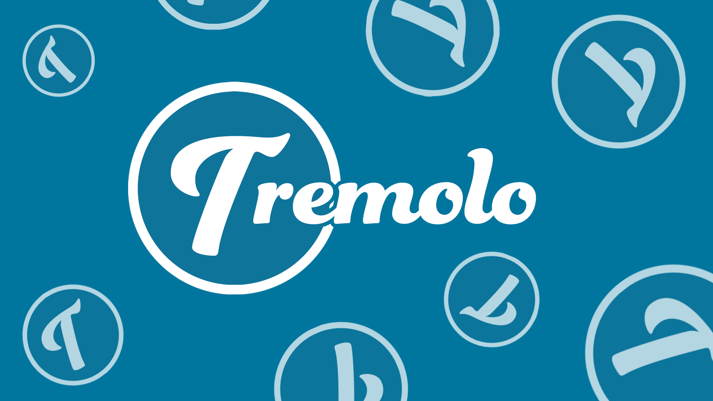

[Live Link](https://tremolo.onrender.com)

## Basic Overview
---
Tremolo is a web app that allows users to upload their listings and also peruse other listings of musical instruments, both used and new.

---
## Technology Used
---
*Ruby
*Rails
*React

## Technical Features
---
```js
//  /tremolo/frontend/src/components/LISTINGS/ListingComponent/index.js

  const DisplayCurrentModelReviews = () => {
    const filtered = modelReviews.filter(review => review.modelReviewedId === listing.modelId)
    return (filtered.map(review => <ReviewTile review={review} /> )
  )}
// /tremolo/frontend/src/components/REVIEWS/ReviewTile.js

   <div className="review-tile-container">
      <h2 id="reviewer-name-model">{review.modelReviewer} // {review.brandName} // {review.modelReviewed}</h2>
        <br />
      <div className="hl" id="tile-hori-line"></div>
      {starsDisplay(review)}          
        <br />
        <div className="hl" id="tile-hori-line"></div>
          <p id="tile-desc-text">
            {`"${review.description}"`}
          </p>
        <br />
        <div className="hl" id="tile-hori-line"></div>

      {isUser ? UserReviewActions() : NonUserReviewActions()}
    </div>

```

This feature was a little hard to pull off, since it required monitoring the current user and then changing the links to appear in such a way that remained visually pleasing. The stars still remain a little bit of a conundrum, but overall, I'm pleased with the progress thus far.

``` css

h1#listing-title.child-ele {
  font-size: 3.5vw;
  font-weight: 500;
  text-decoration: none;
  overflow: hidden;
  text-overflow: ellipsis;
  margin-bottom: -8.5vw;
  display: -webkit-box;
  -webkit-line-clamp: 2;
  line-clamp: 2;
  -webkit-box-orient: vertical;
}

```

CSS seems a little odd to put as something that was a challenge, but for a while, I couldn't think of how to put titles in such a way that didn't disrupt the tile container and kept their general sizes. Text overflow seemed too clunky and scrolling to see the title is not ideal - so coming up with this was a huge relief and came with a massive feeling of triumph.


## Future Features
---
* Cart Functionality
* Watchlist Functionality
* Searchbar Functionality
* Offer Functionality
* Messaging Functionality
* Filter Functionality
